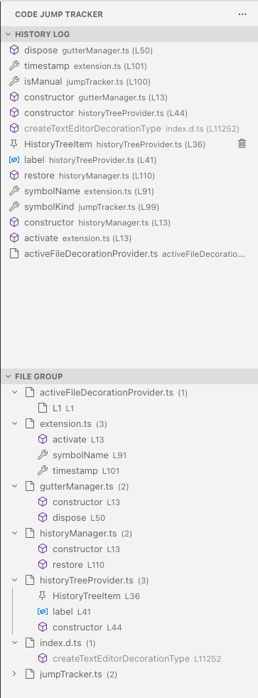

# Code Jump Tracker

A VS Code extension that visually manages your code jump history.
It provides intuitive history management in the sidebar -- similar to `pushd` / `popd` in the shell -- so you never get lost in complex codebases.

> **[日本語版 README はこちら](docs/README_ja.md)**

## Features

- **Auto-tracking** -- Automatically records cross-file navigations and large line jumps (10+ lines) within the same file. Small cursor movements and keyboard selections are excluded
- **Manual bookmarking** -- Bookmark any location via the editor/gutter context menu or a keyboard shortcut
- **Two sidebar views** -- Switch between "History Log" (deduplicated visit history) and "File Group" (entries grouped by file)
- **Gutter pin icon** -- Displays a pin 📌 icon on manually bookmarked lines for quick visual identification
- **Keyboard navigation** -- Navigate back and forward through history with shortcuts
- **Persistence** -- History is saved per workspace and fully restored after restart
- **Sort toggle** -- Switch between newest-first and oldest-first ordering
- **Active file highlight** -- Highlights entries for the currently open file in the sidebar

## Sidebar Views



### History Log

Displays a deduplicated list of visited locations.

- Symbol-type icons (function, class, etc.)
- Pin icon for manually bookmarked entries
- Click any item to jump to that location
- Delete individual entries via the context menu
- Toggle sort order (newest / oldest first)

### File Group

Displays history entries grouped by file in a tree view.

- Root node: file name and entry count
- Child nodes: entries within the file (sorted by line number)
- Duplicate entries for the same file and line are automatically removed

## Commands

| Command | ID | Description |
|----------|-----|------|
| Push to Tracker | `codeJumpTracker.pushManual` | Manually add the current location to history |
| Go Back | `codeJumpTracker.goBack` | Navigate to the previous history entry |
| Go Forward | `codeJumpTracker.goForward` | Navigate to the next history entry |
| Clear All History | `codeJumpTracker.clearAll` | Delete all history entries |
| Delete | `codeJumpTracker.deleteItem` | Delete the selected item |
| Navigate to Entry | `codeJumpTracker.navigateToEntry` | Jump to a history entry |
| Sort: Newest First | `codeJumpTracker.sortOrderDesc` | Sort by newest first |
| Sort: Oldest First | `codeJumpTracker.sortOrderAsc` | Sort by oldest first |

## Key Bindings

| Action | Windows / Linux | macOS |
|------|-----------------|-------|
| Go back | `Alt+Shift+Left` | `Ctrl+Shift+-` |
| Go forward | `Alt+Shift+Right` | `Ctrl+Shift+=` |
| Push to Tracker | `Alt+Shift+P` | `Ctrl+Shift+P` |

## Settings

The following settings are available in `settings.json`.

| Setting | Type | Default | Range | Description |
|------|----|-----------|------|------|
| `codeJumpTracker.maxHistorySize` | `number` | `50` | 1 -- 500 | Maximum number of history entries. Oldest entries are automatically removed when the limit is exceeded |

## Development

### Prerequisites

- Node.js
- npm

### Setup

```bash
npm install
npm run build
```

Press `F5` in VS Code to launch the Extension Development Host.

### npm Scripts

| Script | Description |
|-----------|------|
| `npm run build` | Bundle build with esbuild |
| `npm run watch` | Watch mode build |
| `npm run package` | Generate VSIX package |

### Makefile

Common tasks can also be run with `make`.

| Target | Description |
|-----------|------|
| `make install` | `npm install` |
| `make build` | Production build |
| `make watch` | Watch mode build |
| `make clean` | Remove `dist/` and `*.vsix` |
| `make package` | Generate VSIX package |
| `make local-install` | Build and locally install in one step |
| `make dev` | install + build (ready for F5 launch) |
